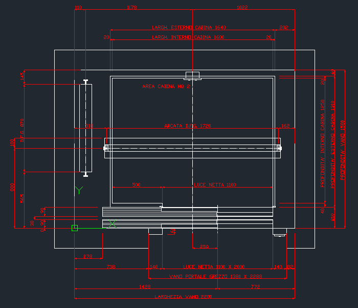

# LiftPlanDXFGenerator

## Description

`LiftPlanDXFGenerator` is a PHP-based application designed to automate the generation of .dxf files tailored for elevator schematics. This tool helps in streamlining the creation of detailed CAD drawings for architects and engineers, allowing for the incorporation of custom specifications.

## Main Features

- **DXF File Generation**: Creates .dxf files that are compatible with various CAD software, tailored to each project's specific needs.
- **Customizable Dimensions**: Facilitates the input of customized dimensions for elevator shafts, cabins, counterweights, and more.

## File Overview

### `index.html`
# Elevator Design Section

This section of the web interface allows users to input specific measurements to generate customized AutoCAD drawings for elevator installations. The interface features a detailed form where users can enter dimensions for various components such as the elevator shaft (Vano), cabin (Cabina), counterweight (Contrappeso), frame (Telaio), and thresholds (Soglia). Each component category has its own subsection within the form, allowing for detailed customization.

## Main Features

### Vano (Shaft)
Users can specify the width, depth, and height of the elevator shaft, as well as the thickness of the shaft walls. This ensures precise fitting within building schematics.

### Cabina (Cabin)
The form allows input for the internal width, length, and wall thickness of the elevator cabin, along with positions for control panels, adapting to different cabin designs and functional requirements.

### Telaio (Frame)
Details such as the frame's height, thickness, and depth can be specified, which are critical for ensuring structural integrity and alignment with architectural designs.

### Contrappeso (Counterweight)
Users have options to select the model and position of the counterweight and can input distances from the guides, which is vital for balancing and smooth operation.

### Arcata (Arch)
The form provides specifications for different arch models and their positioning within the elevator shaft, catering to both aesthetic and functional aspects of elevator design.

### Soglia (Threshold)
Different types of door thresholds can be specified, along with their measurements, enhancing the usability and safety of the elevator.

## Implementation Details

The data collected from this section is submitted to `scrittura.php`, a PHP script responsible for processing the input and generating a downloadable AutoCAD DXF file. This functionality is crucial for translating user inputs into professional CAD drawings that can be directly used for construction and installation. The web page layout includes a navigation bar, a user welcome message, and sections for each component with validation for required fields, ensuring a user-friendly and efficient design interface.

### File Integration

- **`scrittura.php`**: Processes inputs from the web form, generates the DXF content, and provides a downloadable link for the output.
- **`oggettiDXF.php`**: Contains PHP classes that define the structure and functionalities necessary to construct the DXF file components.

This approach not only facilitates the detailed design of elevator components but also aligns with professional standards required for architectural and engineering plans.

### `scrittura.php`

`scrittura.php` is the core script responsible for initiating the DXF file creation process based on user inputs. It processes dimensions and other parameters from a web form, generates the DXF content, and provides a downloadable link for the output. This script includes methods for creating lines, arcs, text, and handling specific geometric drawings like door thresholds, guides, pistons, and arcades.

### `oggettiDXF.php`

This PHP class defines the structure and functionalities necessary to construct the DXF file components. It includes methods for creating various DXF entities such as lines, circles, arcs, and solid fills, as well as handling textual content within the DXF format.

#### Key Functionalities:

- **Shapes and Entities**: Methods like `addLine()`, `addCircle()`, and `addArc()` facilitate the drawing of geometric figures, each tailored for specific parts of the elevator design.
- **Text Handling**: Functions such as `addText()` embed descriptive labels or annotations directly within the DXF drawing, enhancing clarity and usability.
- **Complex Assembly**: More complex methods like `addContrappesoG_Posteriore()` are used to assemble multiple basic shapes into detailed components of the elevator mechanism, reflecting the real-world complexity in schematic form.

#### Details of Operations:

- **Adding Lines and Shapes**: Most methods (`addLine`, `addSolid`, etc.) handle low-level drawing operations, generating geometrical shapes and lines.
- **Handling Door Components**: Specialized methods manage the drawing of door components like thresholds (`addSogliaTelcab_Lateralesx`, `addSogliaTelpia_Lateralesx`, etc.), ensuring proper placement and measurement of architectural elements in relation to other structures like walls and doors.
- **Guides and Supports**: Methods such as `addArcata_anello` and `addArcata_sediadx` suggest the design includes guides or tracks for moving parts, which might be part of larger mechanical systems.
- **Dimensioning and Annotations**: Several methods are dedicated to adding dimensions and annotations (`addQuotasx`, `addQuotadx`, `addQuotadw`, etc.), crucial for architectural and engineering drawings to communicate measurements and important notes.
- **Utility and Helper Methods**: Functions like `SaveFile` handle output, demonstrating integration with file systems and possibly user interfaces for exporting the generated designs.

## Utility Methods

- **`SaveFile($filename)`**: This method facilitates the output of the generated DXF file, offering a direct download capability by setting the appropriate headers and echoing the content to the browser.

This class represents a complex tool tailored for generating DXF (Drawing Exchange Format) files specifically designed for elevator planning and engineering tasks.

## Final Results

Below is an example of a floor plan generated by the LiftPlanDXFGenerator, demonstrating the project's capability to create detailed elevator schematics.

